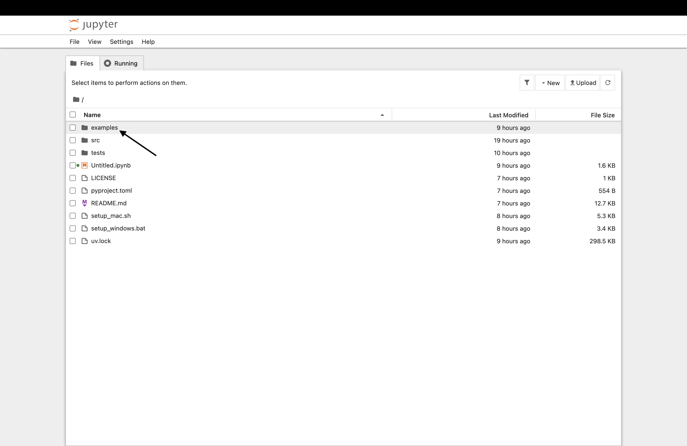
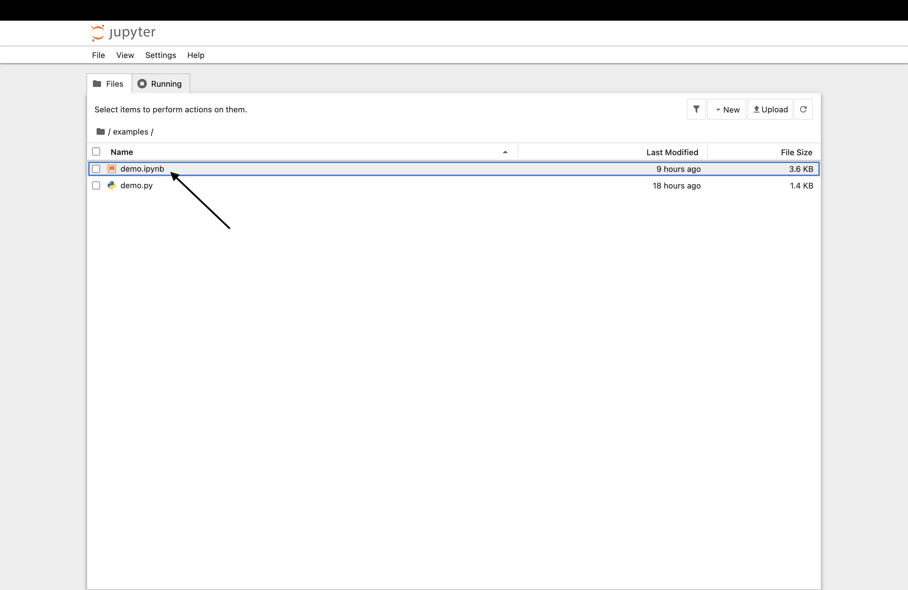
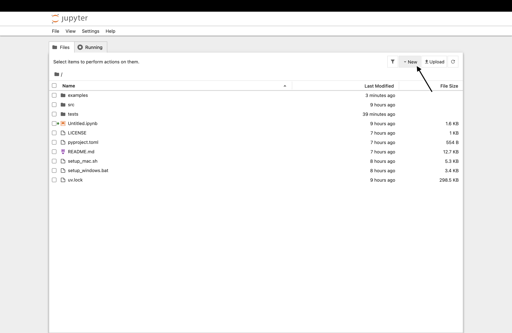
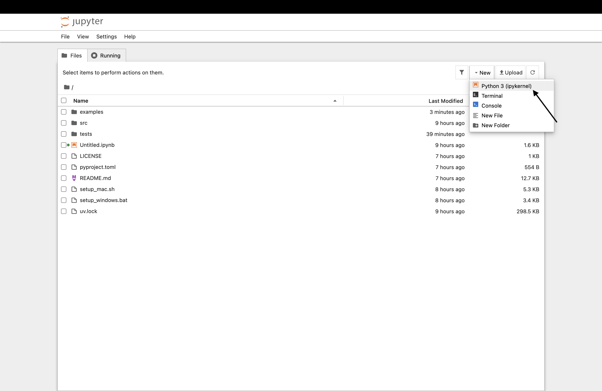

## 導入方法

ターミナルを開く。

以下をコピペで実行。
```bash
git
git clone https://github.com/hitoponu/rubik.git
cd rubik
./setup_mac.command
```

最後の行のかわりに、Finder で `rubik` フォルダを開いて
**`setup_mac.command` をダブルクリック**してもよい。

## 動かし方

Finder で **`start_jupyter.command` をダブルクリック**する。

ターミナルからでもよい。

```bash
./start_jupyter.command
```

ブラウザ上でjupyter notebookが開いたらexamplesのdemo.ipynbを起動する。




> **自分でプログラムを書く場合**
> 
> 

<br>
<br>
<br>
以下はAIが生成したレポジトリの説明です。

# rubik

教育用のルービックキューブ Python ライブラリ。

機能は3つだけ。**リストでの表現**、**27通りの操作**、**マウスで回せる3D表示**
（リスト表現を並べて表示）。
速さより読みやすさを優先していて、わざと遠回りな書き方をしているところがある。

```python
import rubik

rubik.R()                       # 3Dの窓が開いて、右の面が回る
rubik.U()                       # 続けて上の面
rubik.do("RUR'U'", times=6)     # 手順をまとめて。6回くり返すと元に戻る

rubik.show()                    # 展開図を文字で表示
rubik.cube()                    # いまの 6x3x3 リスト
```

使いかたは3通りある。**どれも同じ名前の操作が使える。**
標準ライブラリの `turtle` と同じ組み立てで、下の段から上の段へ段階的に登れる。

| 段 | 書きかた | 状態を持つのは |
|---|---|---|
| 1. いちばん手軽 | `rubik.R()` | rubik が1つ持っている（`rubik.cube()` で取り出す） |
| 2. キューブを作る | `c = rubik.Cube()` / `c.R()` | その `c`（`c.cube()` で取り出す） |
| 3. リストを持ち回る | `after = rubik.R(before)` | 呼び出した側 |

## 準備

```
uv sync
uv run python examples/demo.py          # スクリプトで動かす
uv run jupyter notebook                 # ノートブックで対話的に動かす
```

見本は `examples/demo.py`（スクリプト）と `examples/demo.ipynb`
（ノートブック）の2つ。

## 動作環境

| 使いかた | 3Dの窓 | 備考 |
|---|---|---|
| 手もとの Python スクリプト | ○ | 最後に `rubik.wait()` を置く |
| 手もとの Jupyter Notebook / JupyterLab | ○ | 対話的に使うならこれが一番向いている |
| 手もとの IPython | ○ | 同上 |
| Google Colab | ✗ | 画面のないクラウド上で動くため窓を開けない |
| 画面なしのサーバ、SSH 先 | ✗ | 同上 |

窓が開けない場所では、日本語のメッセージが出る。
リスト表現と27通りの操作、`show()` による展開図表示は**どこでも動く**ので、
Colab でも3D以外はそのまま使える。

### Jupyter Notebook を動かす手順

初回だけ、ノートブックを開発用の依存に加える。

```
uv add --dev notebook
```

あとは毎回これで起動する。

```
uv run jupyter notebook
```

ブラウザが開いたら `examples/demo.ipynb` を選ぶ。カーネルは `Python 3`
をそのまま使えばよい。これはプロジェクトの `.venv` を指しているので、
`import rubik` がそのまま通る。

**かならず `uv run` を通すこと。** 素の `jupyter notebook` で起動すると
別の Python が使われてしまい、`import rubik` に失敗する。

プロジェクトに手を加えたくなければ、その場かぎりの起動もできる。

```
uv run --with notebook jupyter notebook
```

### Jupyter Notebook での使いかた

セルごとに1手ずつ進められる。窓は開いたままで、向きも保たれる。

```python
# セル1
import rubik
rubik.R()                 # 窓が開く。ここでマウスで好きな向きにしておく

# セル2 (何度でも実行できる)
rubik.U()                 # 窓の中身だけが変わる。向きはさわったまま

# セル3
rubik.close()             # 窓を閉じる
```

**`rubik.wait()` は呼ばないこと。** カーネルが窓を閉じるまで止まってしまう。
ノートブックでは `close()` を使うか、そのままにしておけばよい
(カーネルを終了すると窓も閉じる)。

`%matplotlib inline` などを使っていても影響を受けない。
窓は別プロセスで動いていて、`import rubik` した側は matplotlib を
いっさい読み込まないため。

### 環境構築スクリプト

まず rubik を `git clone` して、**そのフォルダの中で**次を実行する。

| OS | 実行のしかた |
|---|---|
| macOS | `setup_mac.command` をダブルクリック |
| Windows | `setup_windows.bat` をダブルクリック |

環境ができたら、あとは `start_jupyter.command`（Windows なら
`uv run jupyter notebook`）で Jupyter Notebook を開ける。

やっていることは3段階で、途中で失敗したらどこで止まったか日本語で出る。

1. `uv` を入れる（すでにあれば飛ばす）
2. `uv sync` で Python と部品をそろえる
3. テストを流して動作を確かめる

最後に「Jupyter Notebook を開きますか」と聞いてくる。

補足。

- `git` は入れない。clone できている時点で入っているため
- uv の入れかたは、macOS は Homebrew があれば `brew install uv`、
  無ければ公式のインストーラ。Windows は `winget` があれば winget、
  無ければ公式のインストーラ。`winget` は必須ではない
- uv を入れた直後は PATH が反映されないことがある。そのときは
  「いったん画面を閉じて、もう一度実行してください」と出るので従う
- macOS の2つのファイルの拡張子が `.sh` ではなく `.command` なのは、
  macOS では `.command` だけが「ダブルクリックしたら Terminal が実行するもの」
  として登録されているため。`.sh` は `.bashrc` などと同じ「ただの文字ファイル」
  あつかいで、ダブルクリックしてもエディタで開くだけになる
- GitHub から ZIP でダウンロードした場合は、macOS が「開発元が未確認」と
  言って止めることがある。その場合はファイルを右クリックして「開く」を選ぶ。
  `git clone` したものなら、そのままダブルクリックできる

### Windows での動きかた

プラットフォームごとの分岐は書いていない。絵の描きかたは
`macosx` → `tkagg` → `qtagg` の順に試すので、Windows では `tkagg`
(Python に同梱の tkinter) が使われる。日本語の表示も
`Yu Gothic` / `MS Gothic` を探すようにしてある。

ただし**手もとに Windows 機がなく、実機での確認はできていない**。
bat ファイルは日本語が化けないよう cp932 と CRLF で書き、
ラベルの対応や echo 行の特殊文字は機械的に検査してある。

## 1. キューブのリスト表現

`6 x 3 x 3` の入れ子リスト。中身は `'B' 'Y' 'R' 'W' 'G' 'O'` の1文字。

```
cube[面][縦][横]
```

面の番号は展開図の並びで決めてある。

```
            +-------+
            | 0  U  |          0 = U  上
    +-------+-------+-------+-------+
    | 1  L  | 2  F  | 3  R  | 4  B  |
    +-------+-------+-------+-------+
            | 5  D  |
            +-------+
```

各面は**その面をキューブの外側から見た状態**で、縦座標は `0` が上・`2` が下、
横座標は `0` が左・`2` が右。どちらが「上」かは面ごとに次のとおり。

| 面 | 「上」の向き |
|---|---|
| L, F, R, B | U 面の側 |
| U | B 面の側 |
| D | F 面の側 |

展開図をそのまま紙に描いて折りたたむと立方体になる、という取り方。
中段を `L, F, R, B` の順に並べたおかげで、`U` と `D` の操作が
「4つの面の段を順ぐりにずらすだけ」になり、添字をひっくり返す処理が出てこない。

`rubik.solved()` で完成状態が作れる。配色は白の裏が黄、緑の裏が青、赤の裏が橙。

| 面 | U | L | F | R | B | D |
|---|---|---|---|---|---|---|
| 色 | W 白 | O 橙 | G 緑 | R 赤 | B 青 | Y 黄 |

ぐちゃぐちゃの状態は `rubik.shuffle()` で作れる。

```python
rubik.shuffle()                     # 完成状態から20手、でたらめに回す
rubik.shuffle(times=5)              # 5手だけ
rubik.shuffle(seed=42)              # 何度やっても同じ配置になる
rubik.cube()                        # 結果はここに入る

after = rubik.shuffle(before, times=3)   # 渡せば新しいリストを返す
```

| 引数 | 既定値 | 意味 |
|---|---|---|
| `cube` | `None` | 回しはじめるキューブ。省くといまのキューブを差しかえる |
| `times` | `20` | 回す回数 |
| `seed` | `None` | 数を渡すと毎回まったく同じ回しかたになる |

`seed` を決めておくと配置を再現できるので、授業で全員に同じ問題を配るときに使える。

外側の18通りの中からその都度1つを選ぶだけなので、`R` のすぐあとに `Ri` が来て
打ち消しあうこともある。それでも `times` が20もあればじゅうぶん混ざる。

### `rubik.cube()` — rubik が持っている1つのキューブ

引数を省いて操作したとき、変わるのはこれ。`cube()` で取り出す。

```python
rubik.R()
rubik.cube()               # いまの 6x3x3 リスト
rubik.cube()[2][0][0]      # F面 (前) の左上のステッカー
rubik.cube(x)              # 差しかえる（値は返さない）
```

返ってくるのは写しではなく**中身そのもの**なので、書きかえればそのまま
状態が変わる。**ただし窓は追随しない。** 描き直したければ `rubik.update()` を呼ぶ。

変数ではなく関数にしてあるのは、`from rubik import *` で取りこんだあとも
いつでもいまの状態が返るようにするため（後述）。

いまの状態を取っておきたいときは、写しを取る。

```python
import copy
before = copy.deepcopy(rubik.cube())
```

### `from rubik import *` で使う

`rubik.` を毎回書かずに済ませたいときは、こう書ける。

```python
from rubik import *

R()
U()
do("RUR'U'", times=6)
cube()                     # 呼ぶたびに、いまの状態が返る
show()
is_solved()
```

**`cube` が変数ではなく関数なのは、これができるようにするため。**
変数だと `from ... import *` した時点の値が名前に貼りついてしまい、
いくら回しても古い状態を返しつづけることになる。

入ってくる名前は58個で、組み込み関数と衝突するものは無い。
ただし `E` や `S` のような1文字の名前も含まれるので、
同じ名前の変数を使っていると上書きされる。

完成しているかどうかは `rubik.is_solved()` で調べる。

```python
rubik.do("RUR'U'", times=6)
rubik.is_solved()          # True
```

> `rubik.solved()` は「調べる」ではなく「**完成状態にする**」関数で、
> 値を返さず 3D の窓を描き直す。出来ぐあいを調べたいときは `is_solved()` を使う。

### 値を返すもの、返さないもの

**状態を変える呼び出しは、そろって何も返さない。**
Jupyter Notebook はセルの最後に書いた式の値を画面に出すので、
値を返すと 6x3x3 のリストがだらだら表示されてしまうため。

```python
rubik.R()                  # None。いまのキューブを回す
rubik.do("RUR'U'")         # None
rubik.solved()             # None
rubik.shuffle(seed=1)      # None
c.R()                      # None。Cube のメソッドも同じ

after = rubik.R(before)    # ← キューブを渡した形は、これまでどおりリストを返す
rubik.is_solved()          # True / False
rubik.parse("RUR'U'")      # ['R', 'U', 'Ri', 'Ui']
```

見わけかたは単純で、**キューブを渡せば値が返り、省けばいまのキューブが変わる**。

## 2. 27通りの操作

`X` を `U D L R F B M E S` のどれかとして、

| 関数 | 意味 |
|---|---|
| `X()` | 時計回りに90度 |
| `Xi()` | 反時計回りに90度（`X'` のこと。i は inverse） |
| `X2()` | 180度 |

### 外側の面を回す18通り

`U Ui U2 D Di D2 L Li L2 R Ri R2 F Fi F2 B Bi B2`

「時計回り」はいつも**その面を外側から見て**時計回りの意味。

### 中段を回す9通り

`M Mi M2 E Ei E2 S Si S2`

外側の面ではなく、**まん中の層だけ**を回す。向きは、はさんでいる面の
片方に合わせるのが決まりごと。

| 名前 | 回る層 | 向き | 由来 |
|---|---|---|---|
| `M` | L と R のあいだ（縦） | `L` と同じ | Middle |
| `E` | U と D のあいだ（横） | `D` と同じ | Equator |
| `S` | F と B のあいだ（奥ゆき） | `F` と同じ | Standing |

```python
rubik.M()                  # まん中の縦の層を回す
rubik.do("M2E'S")          # 手順の中でも使える
```

中段には角の小立方体が無いので、**回しても角は動かない**。
かわりに中心のステッカーが動くので、面の色そのものがずれることがある。

そのため **`shuffle()` は外側の18通りからしか選ばない**。
中段まで混ぜると、完成状態がどれなのか分かりにくくなるため。

**引数を省くか、渡すかで役割が変わる。**

```python
rubik.R()                  # いまのキューブを回して、3Dの窓も描き直す
after = rubik.R(before)    # before を回した新しいリストを返す。窓は触らない
```

引数を渡したときは**もらったキューブを書きかえない**ので、こう書ける。

```python
after = rubik.R(before)    # before はそのまま残っている
```

### 手順をまとめて — `do()`

`'`（プライム）は Python の関数名に使えないので関数のほうは `Ri` としたが、
**文字列でならそのまま書ける**。本や Web の手順を書きかえずに貼りつけられる。

```python
rubik.do("RUR'U'")                 # 空白は無くてよい
rubik.do("R U R' U'")              # あってもよい
rubik.do("RUR'U'", times=6)        # 6回くり返すと元に戻る

after = rubik.do("RU", before)     # 渡せば新しいリストを返すだけ
```

読めない手順は、**何文字目が悪いのか**まで教えてくれる。

```python
rubik.do("RUX'")
# AssertionError: 手順の 3 文字目 'X' が読めません。
# 使えるのは U D L R F B (外側の面) と M E S (中段)、そのあとの ' か 2 です。
```

文字列を操作の名前に直すだけの `rubik.parse()` もある。

```python
rubik.parse("RUR'U'")      # ['R', 'U', 'Ri', 'Ui']
```

渡されたキューブがおかしいときは、日本語の assert で止まる。見るのは3つ。

```python
rubik.U("リストじゃない")
# AssertionError: ルービックキューブはリストで渡してください。

rubik.U([[1, 2, 3]] * 6)
# AssertionError: ルービックキューブは 6x3x3 のリストで渡してください。

cube = rubik.Cube().cube()
cube[2][1][0] = "X"
rubik.U(cube)
# AssertionError: ルービックキューブの中身は 'B' 'Y' 'R' 'W' 'G' 'O' のどれかに
# してください。cube[2][1][0] (F面の 縦1 横0) が 'X' になっています。
```

3つめは**どこが**おかしいのかまで教えてくれる。
この検査は `rubik.check(cube)` として単体でも呼べる。

### どうやって回しているか

90度回すと、ステッカーは4枚ずつの組になって席を交換していく（巡回）。
6つの基本操作（時計回り90度）ぶんの巡回だけを表として `moves.py` に書き下し、
**反時計回りは時計回りを3回、180度は2回**くり返して作っている。
3回まわすのは無駄だが、覚える表が6つで済むので間違えにくい。

## 3. 3Dグラフィクス

| 関数 | 意味 |
|---|---|
| `rubik.init(cube=None)` | 窓を開く。省くといまのキューブ |
| `rubik.update(cube=None)` | 映すキューブを更新する。省くといまのキューブ |
| `rubik.reset_UFR()` | 見る向きを U・F・R が見える向きに戻す |
| `rubik.reset_DBL()` | 見る向きを D・B・L が見える向きに戻す |
| `rubik.wait()` | 窓が閉じられるまで待つ |
| `rubik.close()` | 窓を閉じる |

窓は左右に分かれていて、**左が3Dのキューブ、右がリスト表現**。
どちらも操作のたびに同時に描き直される。

右のパネルは展開図ではなく、**面を 0 から順に並べて、3×3 はそのまま 3×3**。
`cube()[面][縦][横]` の添字が、そのまま升目の位置になる。

```
  0  U        1  L
 W B O       B O O          横は col が増えると右へ
 W B G       O O O          縦は row が増えると下へ
 W R G       O O O

  2  F        3  R
 ...          ...

  4  B        5  D
 ...          ...
```

**窓は最初の操作でひとりでに開く。** `init()` を先に呼ばなくてよい。
`R()` などの操作だけでなく、`solved()` や `shuffle()` でも開く。

窓はマウスのドラッグでぐるぐる回せる。**回しても見ている向きは変わらない。**

`rubik.wait()` を最後に置かないと、プログラムが終わると同時に窓も消える。

窓を閉じたあとは、操作してもひとりでには開き直さない
（画面の無い場所でプロセスが増え続けるのを防ぐため）。
もう一度出すには `rubik.init()` を呼ぶ。

### キューブを自分で作る — `rubik.Cube`

`rubik.Cube()` で、独立したキューブをいくつでも作れる。
`show3d=True` にすると、そのキューブ専用の窓が開く。

```python
c = rubik.Cube()               # 完成状態。窓は持たない
c.R()
c.do("RUR'U'")
c.shuffle(seed=1)
c.show()
c.cube()                       # この個体の 6x3x3 リスト
c.cube(x)                      # 差しかえる
c.is_solved()

a = rubik.Cube(show3d=True)    # 窓つき
b = rubik.Cube(show3d=True)    # 2つめの窓。並べて見くらべられる
```

操作の名前はモジュールの関数と同じ27通り。ほかに
`cube()` `solved()` `shuffle()` `do()` `show()` `is_solved()` と、
窓むけの `init()` `update()` `reset_UFR()` `reset_DBL()` `wait()` `close()` がある。

Jupyter でセルに `c` と書くだけで展開図が出る（`__repr__` が展開図を返す）。

### 向きのリセット

窓を開いたときは `reset_UFR()` と同じ向き、つまり **U（上）・F（前）・R（右）の
3面が見える向き**から始まる。`reset_DBL()` はそのちょうど裏がわで、
**D（下）・B（後）・L（左）の3面が見える**。

2つを行き来すれば6面すべてを確かめられる。マウスで回しすぎて
どこを見ているか分からなくなったときにも使う。

```python
rubik.reset_DBL()    # 裏がわを見る
rubik.reset_UFR()    # 最初の向きに戻す
```

角度は `geometry.py` の `VIEWS` にまとめてある。

| 名前 | elev | azim | 見える面 |
|---|---|---|---|
| `UFR` | 22 | 45 | U 白 / F 緑 / R 赤 |
| `DBL` | -22 | 225 | D 黄 / B 青 / L 橙 |

向きが動くのはこの2つの関数を呼んだときだけで、`update()` では動かない。

### なぜ窓は別プロセスなのか

macOS では、窓を持つプログラムは「メインの流れ」を窓の番人にずっと明け渡して
おかないとマウスを受けつけない。しかし利用者のプログラムは自分のメインの流れで
計算をしたいので、同じプロセスの中では両立しない。そこで窓だけを
別のプロセス（`_window.py`）に追い出し、キューブを1行の JSON にして送っている。

こうすると次の3つが同時に成り立つ。

- 窓はいつでもなめらかに動く（自分のメインの流れを持っているので）
- 利用者のプログラムは `update()` のあとすぐ次の行に進める
- `update()` は**色を塗りかえるだけ**なので、見ている向きは原理的に変わらない

## ファイル

| ファイル | 中身 |
|---|---|
| `src/rubik/state.py` | リスト表現、`solved()`、`show()`、`net()`、形の検査 |
| `src/rubik/moves.py` | 27通りの操作、`shuffle()`、`parse()`、`do()` |
| `src/rubik/interactive.py` | `Cube` クラス |
| `src/rubik/geometry.py` | リストの添字と3次元空間の位置の対応表 |
| `src/rubik/viewer.py` | `Viewer` クラスと `init` `update` `wait` `close` |
| `src/rubik/_window.py` | 窓そのもの（別プロセスで動く）。3D とリスト表現の2枚 |
| `src/rubik/__init__.py` | 3通りの使いかたの入口。27通りの関数をここで組み立てる |
| `setup_mac.command` | macOS の環境構築（uv を入れる）。ダブルクリックで動く |
| `start_jupyter.command` | macOS で Jupyter Notebook を開く。ダブルクリックで動く |
| `setup_windows.bat` | Windows の環境構築（uv を入れる）。ダブルクリックで動く |
| `examples/demo.py` | スクリプトの見本 |
| `examples/demo.ipynb` | Jupyter Notebook の見本 |

## テスト

```
uv run python tests/test_moves.py         # 28件  リスト表現と27通りの操作
uv run python tests/test_interactive.py   # 25件  cube()、do()、Cube
uv run python tests/test_star_import.py   # 10件  from rubik import * で使う
uv run python tests/test_viewer.py        # 16件  3Dグラフィクスとリスト表現パネル
```

操作の正しさは、よく知られた「手順の周期」と突き合わせて確かめている。
たとえば `R U` をくり返すと105回で、`R U R' U'` なら6回で完成状態に戻る。

どのテストも窓は開かない（`test_viewer.py` の1件だけ、Jupyter でも窓が
落ちないことを確かめるために、ほんの数秒だけ本当に窓を出す）。
